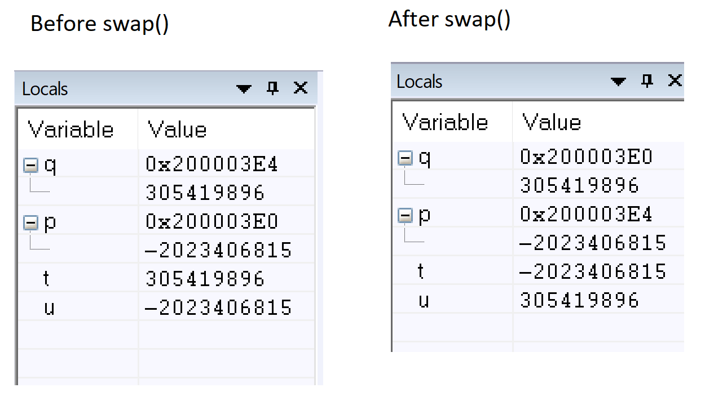

1. Create a function in “C” that allows swapping of two pointers. 
a. Explain what the “main” function does in order to setup the input arguments prior to 
calling the swap_pointer() function? 
I pass pointers to pointers to the function in C. The main function simply puts the addresses of the pointers in R0 and R1, the calls the swap function.
b. What are the values in R0 & R1 when swap_pointer() is called? 
R0 = 0x200003EC and R1 = 0x200003E8. These point to memory that have the values 0x200003E4 and 0x200003E0, respectively.
c. Share a screen shot of the local variables inside of “main” after the function 
swap_pointer() returns showing the values of the pointers and what they are pointing to 
(similar to the picture below).

